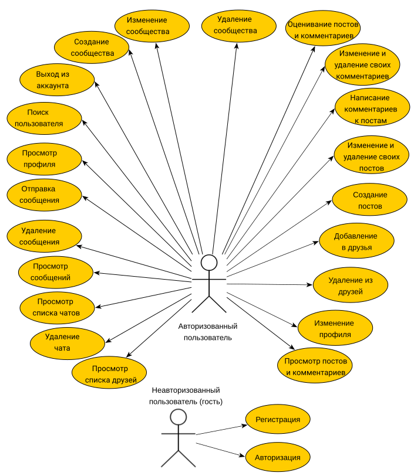
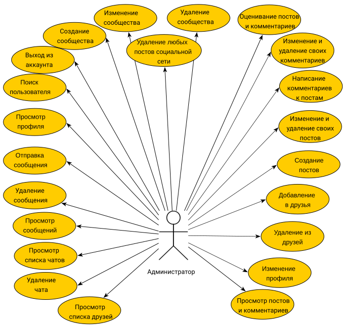
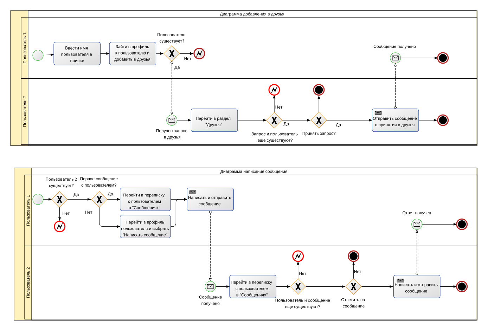
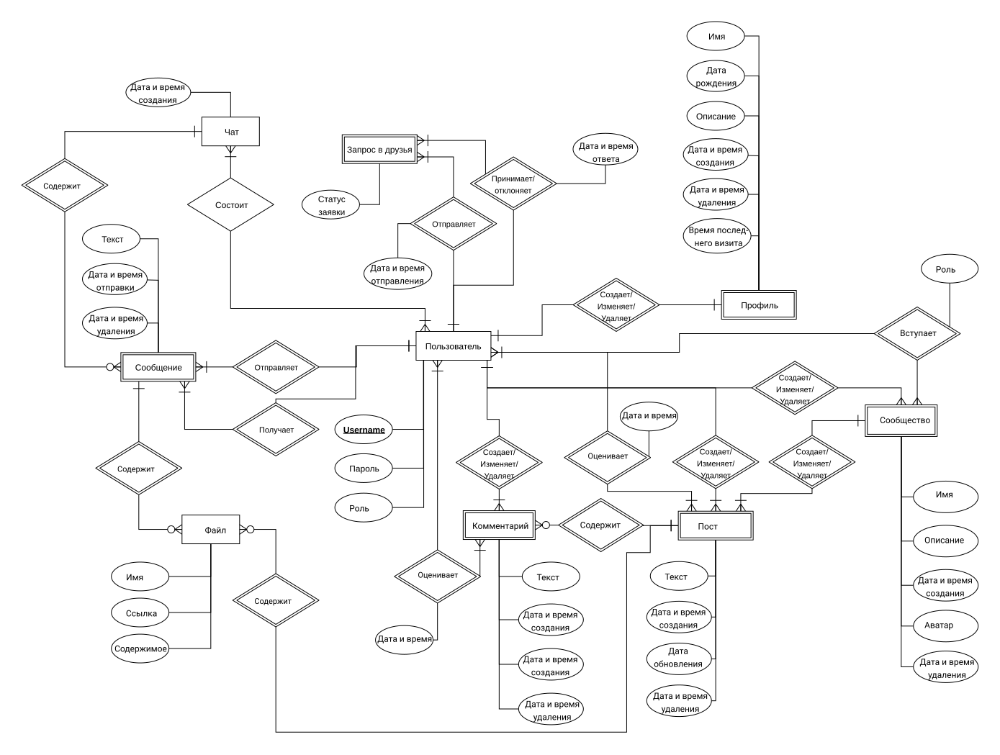
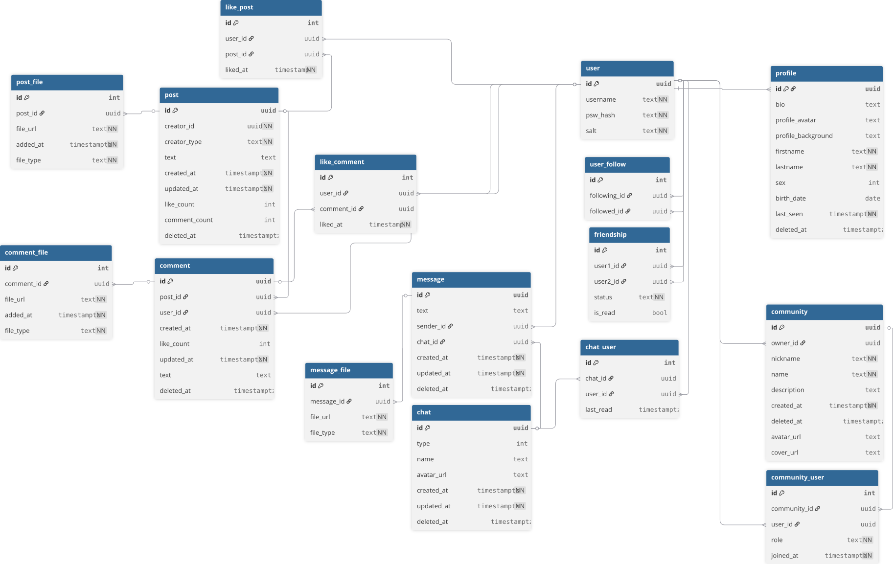
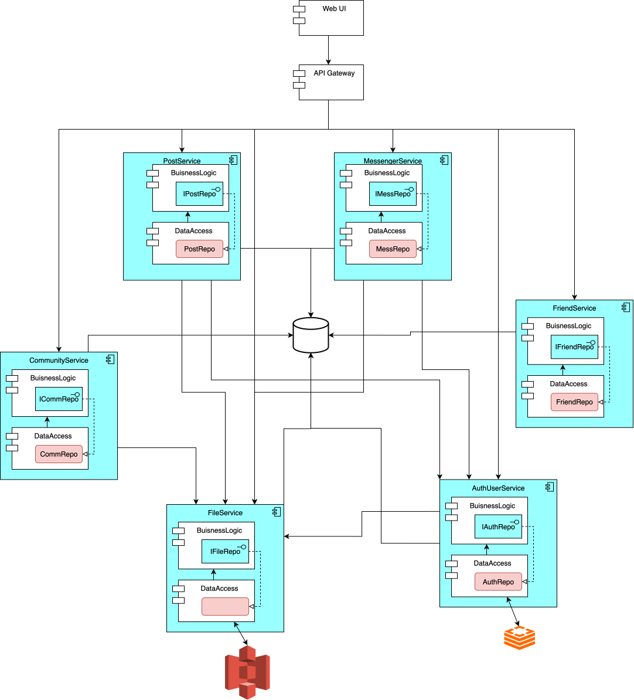

# Проект QuickFlow

QuickFlow — учебная социальная сеть с микросервисным backend на Go. Проект разработан в рамках курса МГТУ им. Н. Э. Баумана и включает сервисы публикаций, пользователей, сообщений, друзей, сообществ и файлов, единый HTTP gateway, инфраструктуру и набор автоматических тестов. Проект является расширением написанного мною во время обучения в VK Education [проекта](https://github.com/go-park-mail-ru/2025_1_QuickFlow).

## Навигация

- [Возможности](#функциональные-требования)
- [Архитектура и стек](#архитектура-и-технологический-стек)
- [Структура репозитория](#структура-репозитория)
- [Быстрый запуск](#быстрый-запуск)
- [Тестирование](#тестирование)
- [CI/CD](#cicd)
- [Проектные диаграммы](#use-case---диаграмма)

## Краткое описание идеи проекта
Платформа предназначена для онлайн-взаимодействия пользователей. В ней можно создавать и редактировать профиль, добавлять друзей, вести личную переписку, создавать сообщества и публикации, комментировать их и прикреплять файлы.

## Функциональные требования  

- Создание и изменение профиля
- Авторизация в социальной сети с помощью логина и пароля
- Добавление, удаление, изменение постов
- Добавление, изменение и удаление комментариев к постам
- Просмотр постов своих друзей, а также тех, на кого пользователь подписан
- Просмотр всех постов социальной сети
- Добавление и удаление друзей
- Написание и удаление сообщений в личной переписке
- Создание, изменение, удаление сообществ
- Отметка лайком понравившихся постов и комментариев

## Архитектура и технологический стек

Приложение построено как набор Go-микросервисов. Внешние HTTP-запросы принимает gateway, а внутреннее взаимодействие сервисов выполняется по gRPC. Состояние хранится в PostgreSQL и Redis, файлы — в S3-совместимом MinIO. Метрики собираются Prometheus и визуализируются в Grafana.

| Компонент | Назначение | Порт по умолчанию |
| --- | --- | ---: |
| `gateway` | единая HTTP-точка входа | 8080 |
| `file_service` | загрузка и получение файлов | 8081 |
| `post_service` | посты, комментарии и лайки | 8082 |
| `user_service` | пользователи и профили | 8083 |
| `messenger_service` | чаты, сообщения и стикеры | 8084 |
| `feedback_service` | обратная связь (отключён в основном compose-файле) | 8085 |
| `friends_service` | дружба и подписки | 8086 |
| `community_service` | сообщества и членство | 8087 |

Основной стек:

- backend: Go 1.24, gRPC, PostgreSQL, Redis и MinIO;
- API gateway: HTTP/WebSocket;
- инфраструктура: Docker Compose, Nginx, Prometheus и Grafana;
- тестирование: стандартный пакет `testing`, Testify, GoMock, sqlmock и Allure;
- CI: GitHub Actions и изолированные Docker-образы для тестов сервисов.

## Структура репозитория

```text
.
├── backend/                 # Go-модуль, gateway и микросервисы
│   ├── gateway/             # внешний HTTP/WebSocket API
│   ├── *_service/           # предметные микросервисы
│   ├── shared/              # общие модели, клиенты, proto и логгер
│   └── config/              # загрузка и проверка конфигурации
├── deploy/                  # Compose, Nginx, SQL и monitoring
├── docs/                    # сгенерированная Swagger-документация
├── tests/                   # integration- и e2e-окружение
├── images/                  # диаграммы и макеты
└── .github/workflows/       # CI pipeline
```

## Быстрый запуск

Понадобятся Docker с Compose v2 и `make`. Для запуска или тестирования без контейнеров также нужен Go 1.24.

1. Запустите PostgreSQL, Redis, MinIO и monitoring. Этот compose-файл также создаст сеть `backend-network`:

   ```bash
   docker compose -f deploy/docker-compose.infra.yaml up -d
   ```

2. Соберите и запустите прикладные сервисы:

   ```bash
   make up
   ```

3. Проверьте состояние контейнеров и gateway:

   ```bash
   make ps
   curl http://localhost:8080/hello
   ```

По умолчанию gateway доступен по адресу `http://localhost:8080`, консоль MinIO — `http://localhost:9001`, Prometheus — `http://localhost:9090`, Grafana — `http://localhost:3001`.

Полезные команды:

```bash
make logs                 # логи прикладных сервисов
make restart              # перезапуск
make down                 # остановка прикладных сервисов
make down ERASE=yes       # остановка с удалением их volumes
docker compose -f deploy/docker-compose.infra.yaml down
```

Настройки сервисов находятся в `deploy/.env` и `deploy/config/`. Не публикуйте реальные пароли и токены при создании собственного окружения.

## Тестирование

Тестовое окружение описано в `tests/docker-compose.yml`:

```bash
make unit          # модульные тесты
make integration   # интеграционные тесты
make e2e           # сквозные тесты через gateway
make all           # полный набор и Allure-отчёт
```

Отдельный сервис можно проверить напрямую из Go-модуля:

```bash
cd backend
go test ./post_service/...
go vet ./post_service/...
```

Для статического анализа всего backend используется `make lint` (требуется установленный `golangci-lint`).

## CI/CD

Workflow `.github/workflows/go.yml` запускается при push в `main`. Сначала каждый микросервис собирается и тестируется в собственном Docker-контейнере, после успешных unit jobs запускаются integration-тесты, затем e2e-тесты. Такая последовательность не допускает запуск дорогих сквозных проверок при падении отдельного сервиса.

## Use-Case - диаграмма



## Формализация ключевых бизнес-процессов



## Пользовательские сценарии
- Сценарий добавления в друзья:
	1. Будучи авторизованным пользователем, перейти во вкладку "Друзья";
	2. Ввести имя пользователя в строке поиска;
	3. Выбрать один из предложенных вариантов;
	4. Перейти в профиль пользователя и нажать кнопку "Добавить в друзья".

- Сценарий написания первого сообщения:
	1. Будучи авторизованным пользователем, перейти во вкладку "Друзья";
	2. Выбрать пользователя из списка и перейти к нему в профиль;
	3. Нажать на кнопку "Написать сообщение", перейдя к диалогу с пользователем;
	4. Ввести текст сообщения и нажать кнопку "Отправить".

- Сценарий изменения информации о себе в профиле:
	1. Будучи авторизованным пользователем, перейти во вкладку "Профиль";
	2. Нажать на кнопку "Редактировать";
	3. В окне редактирования информации о себе ввести новый текст;
	4. Нажать на кнопку "Сохранить изменения".

- Сценарий добавления поста:
	1. Будучи авторизованным пользователем, перейти во вкладку "Профиль" или "Лента";
	2. Нажать кнопку "Создать пост";
	3. Ввести текст поста и при необходимости добавить медиафайлы;
	4. Нажать кнопку "Опубликовать".

- Сценарий изменения поста:
	1. Будучи авторизованным пользователем, перейти к своему посту;
	2. Нажать кнопку "Изменить";
	3. Внести изменения в текст поста;
	4. Добавить файлы к посту или удалить уже добавленные;
	5. Нажать кнопку "Сохранить изменения".

- Сценарий добавления комментария:
	1. Будучи авторизованным пользователем, выбрать пост для комментирования;
	2. В поле для комментариев ввести текст;
	3. Нажать кнопку "Отправить".

- Сценарий создания сообщества:
	1. Будучи авторизованным пользователем, перейти во вкладку "Сообщества";
	2. Нажать кнопку "Создать сообщество";
	3. Ввести название и описание сообщества;
	4. Нажать кнопку "Создать".

## ER-диаграмма сущностей



## Описание типа приложения и выбранного технологического стека
Тип приложения: **Web SPA**.

Backend: **Golang** + микросервисы **gRPC**.

Frontend: **HTML + CSS + Typescript + ReactJS**.

Storage: **PostgreSQL + Redis + Minio S3**.

## Диаграмма БД



## Компонентная диаграмма системы



## Экраны WEB-приложения


