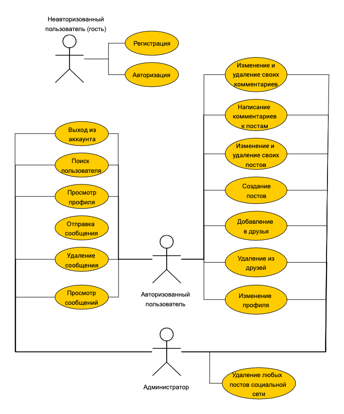
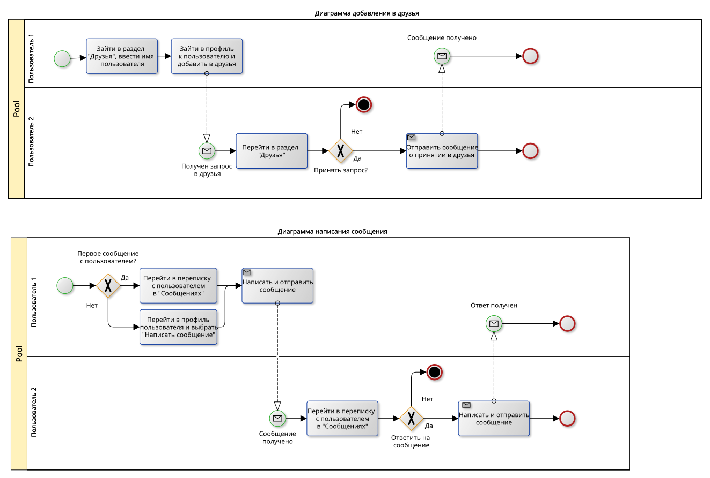
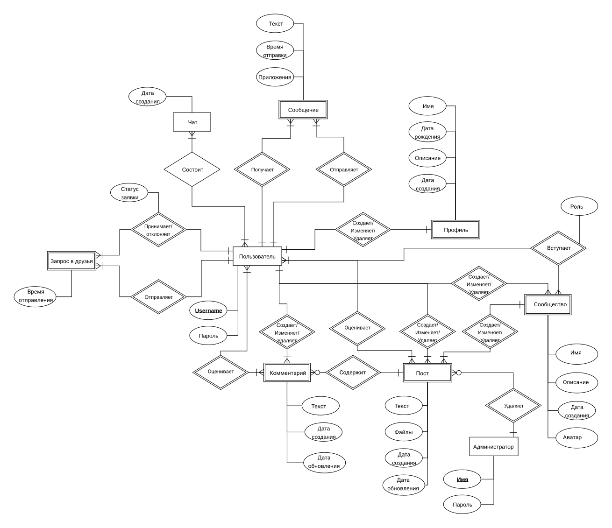
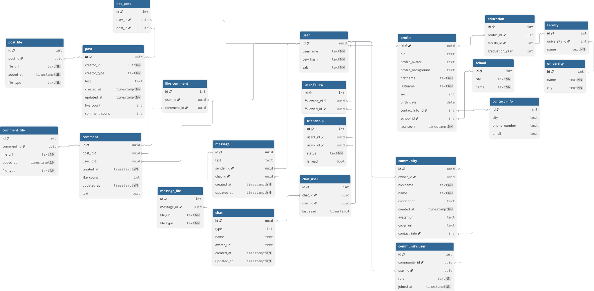
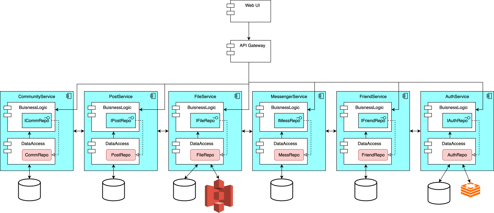

# Проект QuickFlow

## Цель работы, решаемая проблема

## Краткое описание идеи проекта
Данный проект направлен на реализацию платформы для онлайн-взаимодействия пользователей. Пользователи продукта смогут создавать и редактировать личные профили, добавлять других пользователей в друзья, писать им сообщения, приватно просмотривать их профиль. 

## Функциональные требования  

- Создание и изменение профиля
- Авторизация в социальной сети с помощью логина и пароля
- Добавление, удаление, изменение постов
- Добавление, изменение и удаление комментариев к постам
- Просмотр постов своих друзей, а также тех, на кого пользователь подписан
- Просмотр всех постов социальной сети
- Добавление и удаление друзей
- Написание и удаление сообщений в личной переписке
- Создание, изменение, удаление сообществ
- Отметка лайком понравившихся постов и комментариев

## Use-Case - диаграмма

## Формализация ключевых бизнес-процессов

## Пользовательские сценарии
- Сценарий добавления в друзья:
	1. Будучи авторизованным пользователем, перейти во вкладку "Друзья";
	2. Ввести имя пользователя в строке поиска;
	3. Выбрать один из предложенных вариантов;
	4. Перейти в профиль пользователя и нажать кнопку "Добавить в друзья".

- Сценарий написания первого сообщения:
	1. Будучи авторизованным пользователем, перейти во вкладку "Друзья";
	2. Выбрать пользователя из списка и перейти к нему в профиль;
	3. Нажать на кнопку "Написать сообщение", перейдя к диалогу с пользователем;
	4. Ввести текст сообщения и нажать кнопку "Отправить".

- Сценарий изменения информации о себе в профиле:
	1. Будучи авторизованным пользователем, перейти во вкладку "Профиль";
	2. Нажать на кнопку "Редактировать";
	3. В окне редактирования информации о себе ввести новый текст;
	4. Нажать на кнопку "Сохранить изменения".

- Сценарий добавления поста:
	1. Будучи авторизованным пользователем, перейти во вкладку "Профиль" или "Лента";
	2. Нажать кнопку "Создать пост";
	3. Ввести текст поста и при необходимости добавить медиафайлы;
	4. Нажать кнопку "Опубликовать".

- Сценарий изменения поста:
	1. Будучи авторизованным пользователем, перейти к своему посту;
	2. Нажать кнопку "Изменить";
	3. Внести изменения в текст поста;
	4. Добавить файлы к посту или удалить уже добавленные;
	5. Нажать кнопку "Сохранить изменения".

- Сценарий добавления комментария:
	1. Будучи авторизованным пользователем, выбрать пост для комментирования;
	2. В поле для комментариев ввести текст;
	3. Нажать кнопку "Отправить".

- Сценарий создания сообщества:
	1. Будучи авторизованным пользователем, перейти во вкладку "Сообщества";
	2. Нажать кнопку "Создать сообщество";
	3. Ввести название и описание сообщества;
	4. Нажать кнопку "Создать".

## ER-диаграмма сущностей

## Описание типа приложения и выбранного технологического стека
Тип приложения: **Web SPA**.

Backend: **Golang** + микросервисы **gRPC**.

Frontend: **HTML + CSS + Typescript + ReactJS**.

Storage: **PostgreSQL + Redis + Minio S3**.

## Диаграмма БД

## Компонентная диаграмма системы

## Экраны будущего WEB-приложения